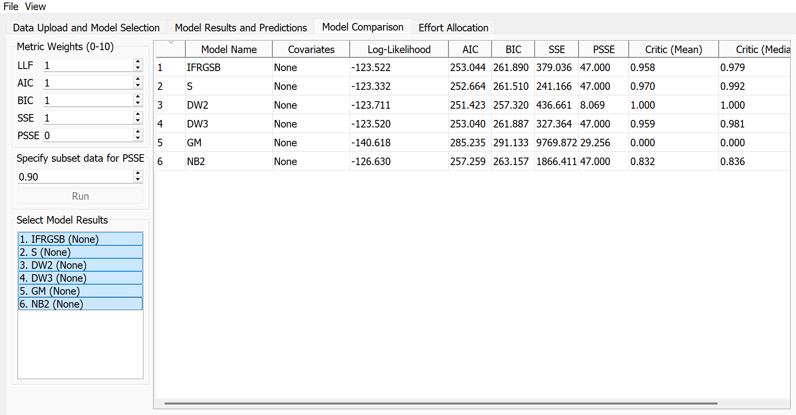
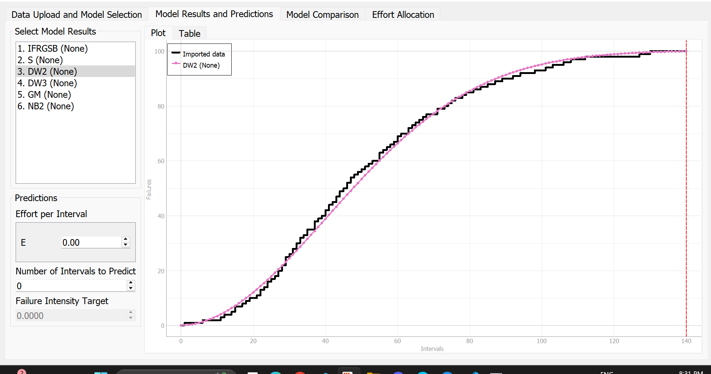
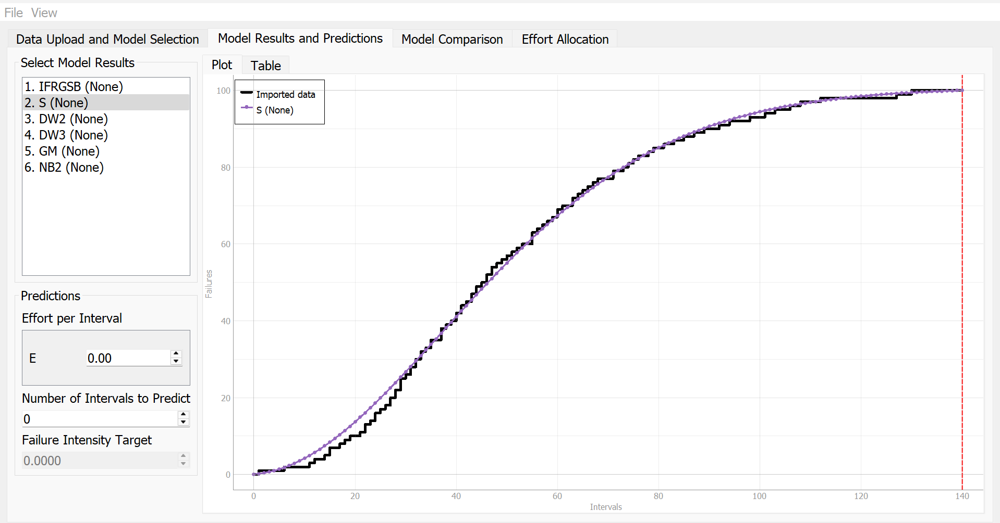

**SENG 438- Software Testing, Reliability, and Quality**

**Lab. Report \#5 – Software Reliability Assessment**

| Group \#:       |   |
|-----------------|---|
| Student Names:  |Rakshita Suri   |
|                 |Mohit Kaila   |
|                 |Okibe Abang   |
|                 |   |

# Introduction

In this assignment, we had to check how reliable a software system is by looking at when and how often it fails. Our group split the work, and we worked on the first part using a tool called C-SFRAT. This tool helps us see if the system is improving over time as more testing is done. The goal was to find out if the system becomes more reliable and which model best explains the failure data.

# Assessment Using Reliability Growth Testing 

We started by converting the given dataset (DATASET1.DAT) into the format that C-SFRAT needs. We used only the useful parts of the data and made a CSV file with three columns: T (time), FC (failure count), and E (execution time). Then we loaded the file into C-SFRAT and ran several reliability models.

We tested the following models:

- Discrete Weibull (Order 2)

- Salvia & Bollinger

- Generalized Salvia & Bollinger

- Geometric

- Negative Binomial (Order 2)

After running the tool and comparing results, we found that the two best models were:

Discrete Weibull (Order 2): It had the lowest AIC (251.42) and a perfect match score of 1.0.

Salvia & Bollinger: This model also had strong results with a match score of 0.97.

We used the Model Comparison Table in C-SFRAT to help pick the best models. It shows values like AIC, BIC, and Log-Likelihood for each model. The Discrete Weibull (Order 2) model had the lowest AIC and a perfect match score, so we chose that as the best. Salvia & Bollinger was also close and had strong results, so we picked it as the second-best

We took screenshots of the model comparison table and the plots for both models. The plots show how well each model predicted the actual failures. The black lines show real failure data and the colored lines show the model's prediction. Both models followed the real data closely.

Screenshots:

Model Comparison Table

DW2 – Discrete Weibull (Order 2) – Prediction Plot

S – Salvia & Bollinger – Prediction Plot

# Assessment Using Reliability Demonstration Chart 

# 

# Comparison of Results

# Discussion on Similarity and Differences of the Two Techniques

# How the team work/effort was divided and managed
Two members of the team were focussing on part 1: Reliability Growth Testing. The other two focussed on part 2: Reliability Demonstration Chart. After completing both parts, our group shared the learnings with each other so that every member of the group had an equal opportunity to learn from this lab. We worked together on completing the report by dividing the parts equally. We had constant check-ins during last two weeks to ensure that everyone on the team was on same page. We collaborated using Github and communicated using a discord group chat to make sure we did the project smoothly. 

# Difficulties encountered, challenges overcome, and lessons learned
Our team faced initial challenges in using Reliability demonstration chart as it was challenging to understand how the chart worked. It took some time for our team and the help of TAs to understand how it worked. It was a new topic and we hadn't used anything similar to this before. Our skills to use such charts was overcome by our group's collective effort towards the completion of this assignment. It taught us the importance of group work as well as how assessment using Reliability Demonstration Chart worked. We also became more confident in Reliability Growth Testing by applying in part1 and following the assignment instructions. This assignment was a learning experience as we got an opportunity to apply our learnings on a hands-on assessment. 
# Comments/feedback on the lab itself
The lab was easy to understand and follow. It was shorter than the previous labs and didn't take very long to complete. Overall, the instructions were clear and it was a good learning experience for the whole group. 
